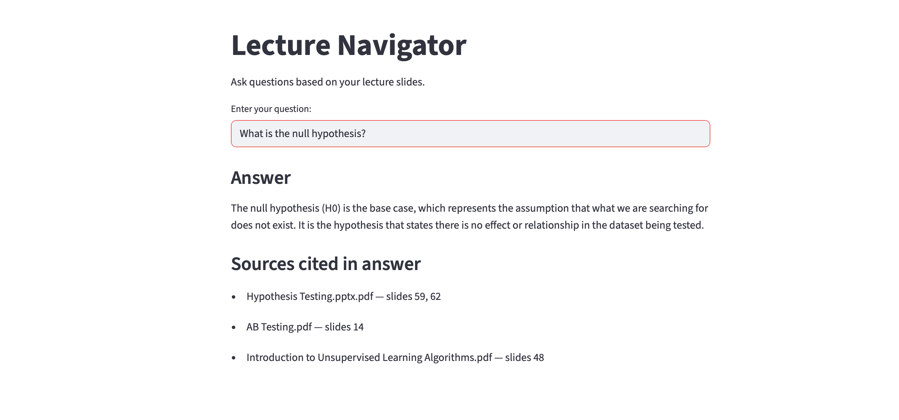
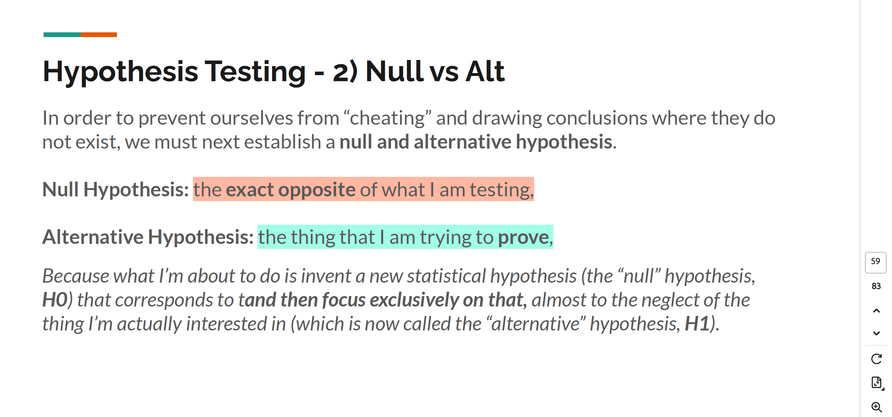

# Lecture Navigator

> LLM-powered assistant for querying lecture slides through a lightweight Streamlit interface.

## Features

- **Smart lecture search**: Accepts natural-language questions and returns grounded answers with slide-level citations.
- **Built-in slide loader**: Scans and preprocesses all PDFs in the `data/` folder into searchable document chunks.
- **Retrieval-augmented generation**: Uses vector similarity search with OpenAI embeddings and a language model to generate context-aware responses.
- **Streamlit interface**: Minimal UI for running local semantic search and viewing citations in real time.

## Project Structure

<pre><code>.
├── app
│   ├── __pycache__
│   └── main.py               # Streamlit app to run the Lecture Navigator UI
│   
├── backend                   # Core logic for PDF loading, splitting, embedding, and QA
│   ├── __init__.py    
│   ├── data_loader.py        # Loads PDFs from the data folder
│   ├── splitter.py           # Splits documents into smaller chunks
│   ├── vectorstore.py        # Embeds chunks and stores them in FAISS
│   ├── qa_chain.py           # Builds the LangChain QA chain
│   └── pipeline.py           # Initializes the full pipeline 
│   
├── data                      #Folder containing lecture PDF slides
│   └── *.pdf
├── env
│   └── .env                  # Your OpenAI API key goes here
├── notebooks
│   └── test_questions.ipynb  # Notebook for asking questions and interacting with results
│   
├── preview                   # UI preview images
│   ├── question_answer.png
│   └── slide_preview.png
├── README.md
└── requirements.txt
</code></pre>

## Installation

1. **Clone the repository**  
```bash
git clone https://github.com/your-username/lecture-navigator.git
cd lecture-navigator
```

2. **Create and activate a virtual environment**  
```bash
conda create -n lecture-navigator python=3.11 -y
conda activate lecture-navigator
```

3. **Install dependencies**  
```bash
pip install -r requirements.txt
```

4. **Set up your OpenAI API key**

Create a file named `.env` inside the `env/` directory  
Add your OpenAI API key like this:
```text
OPENAI_API_KEY=your_openai_api_key_here
```

> Make sure not to share this key publicly. It gives access to your usage and billing on the OpenAI platform.

5. **Add your PDF lecture slides**
Create the `data/` folder if it doesn't already exist:
```bash
mkdir data
```
Place all your lecture slides (as `.pdf` files) into the `data/` folder.


## Run the app with Streamlit

To launch the interactive app in your browser, run the following command from the root directory:

```bash
python -m streamlit run app/main.py
```

This will open a local Streamlit interface where you can:

- Ask natural-language questions about your lecture slides  
- Get answers with source citations (slide numbers and file names)

## User Interface Preview

Here’s what the app looks like in action:

### Question with Source-Cited Answer


### Slide Snippet and Reference Details


## Run in Notebook (Optional)

- Open [`notebooks/test_questions.ipynb`](notebooks/test_questions.ipynb) to explore the system in a code-first environment.  
- The notebook includes preconfigured environment loading, pipeline initialization, and sample questions.  
- Modify the list of questions to reflect content from the PDFs stored in the `data/` folder.

> Useful for testing, debugging, and custom evaluation without launching the Streamlit interface.

## Collaborators

- **Darylisha Williams** — [@dwilliams170](https://github.com/dwilliams170)  
- **Gennadii Ershov** — [@imwaymaran](https://github.com/imwaymaran)  
- **Jessica Lawrence** — [@JessLawren](https://github.com/JessLawren)  
- **Lubna Asmi** — [@lubnaasmi](https://github.com/lubnaasmi)  

## License

This project is licensed under the [MIT License](LICENSE).

## Acknowledgments

This project was developed as part of The Knowledge House's [Innovation Fellowship](https://www.theknowledgehouse.org/).  
Special thanks to the TKH team for their support and guidance.

- Built using [LangChain](https://www.langchain.com/)
- Powered by [OpenAI](https://openai.com/)
- Vector storage with [FAISS](https://github.com/facebookresearch/faiss)
- UI built with [Streamlit](https://streamlit.io/)